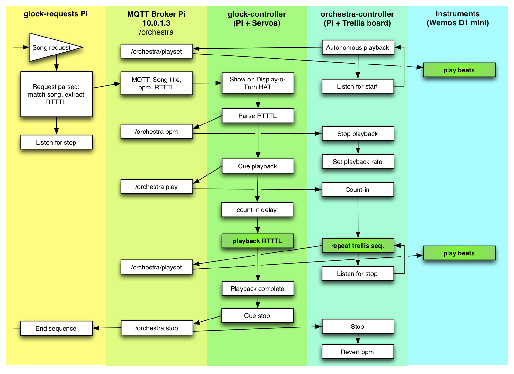

# Robot Orchestra v3

A network of instrument-bashing robots. This version has the following features:

* Supports ESP8266 orchestra robots, commanded over MQTT on local wifi. 8 channels are switchable at runtime by grounding pins D5,6,7 to earth as a binary channel identifier. The specific ESP modules used are [Wemos D1 minis](https://wiki.wemos.cc/products:d1:d1_mini).
* Python-based orchestra controller running on a Pi host, using an [Adafruit Hella UNTZtrument](https://www.adafruit.com/product/1999) button controller board as a physical sequencer. The UNTZtrument is 4x2 grid of 4x4 button/light [Trellis](https://learn.adafruit.com/adafruit-trellis-diy-open-source-led-keypad/overview) boards. The controller script outputs beat patterns over MQTT.
* MQTT command pattern is a string (!) of eight 1/0 signals, per beat. Yes, this is terrible... but it's also terribly simple.
* Integration of robotic glockenspiel, playing melodies: a separate glockenspiel controller listens for MQTT packages containing RTTTL ringtone code strings, then cues playback for itself and the orchestra robots. The physical glockenspiel was a copper pipe instrument with servo-actuated hammers; a full octave running off a single Raspberry Pi. Python script.
* A requests controller (Pi/Python) takes song requests at the console, sloppy matches input strings against a library of approx. 10k 1990s-vintage mobile phone ringtones, and sends the best match (however bad that might be) to the glockenspiel. The percussion 'orchestra' plays along, sort-of synchronised with the glockenspiel.

Other components (in earlier repositories, because they're maybe still relevant) included a software version of the UNTZtrument controller, coded in Python GUIZero.

## Current status

The specific glockenspiel this release was developed to drive did not survive a hectic weekend of use at the Great Exhibition of the North Family Expo, summer 2018. It was retired / recycled subsequently. Hence, we currently have a controller with nothing to control. Sniff.

At present, the synchronisation between the 'orchestra' robots (ie. percussion, handled by the Wemos D1s and controlled from the UNTZtrument button board) and the melody-playing glockenspiel is ... terrible. This is partly a latency issue, and partly a result of the RTTTL song library being of highly variable standard. Robot Orchestra v4, in a parallel repository, starts to address this by:

* Translating RTTTL to Sonic Pi (Ruby) files, for ease of editing. Though how we'd ever get through the library, I have no idea.
* Porting the system to OSC (UDP) messaging, rather than MQTT, for lower latency and future integration with other audio platforms.
* Handling OSC broadcast messaging (which isn't native to Sonic Pi).
* Coding in latency offsets for hetereogeneous platforms (ie. slowing down the response from the D1 minis because they're too quick compared to the Pi/Python).

## Issues

At some point, the UNTZtrument controller script `orchestra-controller.py` turned into a rubbish drummer. When first written, it was excellent at keeping (perceived) time; at present, it's not particularly great. It's not clear why this is the case, and some investigation is required. Cleaning up the system and moving to OSC messaging was part of the reason for the v4 codebase, though it's not yet clear if this has addressed the issue (!).

## Configuration & script purpose

(in the below diagram, script names are in bold, with plain text representing MQTT paths. Except where it's just text. TODO: clarify this.)

Messaging between system components is entirely via MQTT. The system is loosely-coupled, and typically survives momentary disruption or restart of individual components. Accordingly, no quality of service control is applied at all: no component cares whether its message is received, and there's no error handling anywhere. Consequently, D1 mini boards can leave or join the network seamlessly. However, missed messages could in principle leave the system in an out-of-sync state across the multiple Pis controlling different aspects. We've never seen this, but the system would likely recover following another song request.

...or just turn it all off and turn it back on again, as usual.

Every Pi involved in the system will need a python MQTT library:

    pip3 install paho-mqtt

See individual Python files for additional requirements.

By design, `glock-controller` and `glock-requests` can be entirely ommitted from the system as deployed -- `orchestra-controller` will handle simple beat sequencing for Wemos D1-based instruments, and the messaging pathways for song request playback are never triggered. This gives some scalability for different deployment scenarios. For workshop use, we typically use just `glock-controller` and the D1 minis; if we have more of an exhibition/drop-in activity, we might add the glockenspiel melody line to the system.

### glock-controller

Python-based player client for Raspberry Pi GPIO. Uses GPIOZero, with the `pigpiod` pin factory for better servo performance -- which can typically handle at least 8 servos in software on a Pi 3, versus only three or four using the default pin factory. The issue is PWM performance; the Pi handles PWM in software by bit-banging, with `pigpiod` taking a more efficient route to achieving that, so the onset of servo-wobbling timing issues happens at around the 10 or 11 servo mark.

`glock-controller` parses received RTTTL ringtone files into notes and timing intervals, and handles playback, then messages the system to note that playback is complete.

## glock-requests

User front-end to the song library. Takes a string input, matches against a song list (using fuzzy matching - a match is always found, no matter how wayward), and sends the appropriate RTTTL ringtone string to the `glock-controller`. It then waits until `glock-controller` signals completion of playback.

The interface presented is purely console-based, with some minor decoration using terminal colours and large (baked-in graphic) type. It's currently not suited to unsupervised use; escape sequences are not caught.

### orchestra-controller

Handles beat patterns read from the Hella UNTZtrument and distribution of those to the network for D1 mini instruments -- in most circumstnaces, this is the core of the system.

Needs Adafruit GPIO installed:

    git clone https://github.com/tdicola/Adafruit_Trellis_Python
    cd Adafruit_Trellis_Python
    sudo python setup.py install
    pip3 install adafruit-gpio

## Sequence of operation

### Bring up network

Boot your wifi router. We use an old Apple Airport because we had it to hand. It's also proven reliable with:

* Frequent disconnects / reconnects of clients.
* Many clients (ie. >30). Not all domestic routers will handle this.
* Fairly rapid DHCP grants; the delay between powering up a D1 mini and it acquiring networking and messaging receipt is a fraction longer than I'd like, but workable. The only other router I've tried was a very old Linksys, which took just a hair longer to connect a client... and that prompts many more workshop participants to assume their board doesn't work and pull the power just before it would have burst into life. Sometimes, 150 msec matters.
* When bridged (typically via Ethernet to a Mac set to share its wifi connection to Ethernet), the entire network receives routing to the world. Which is occasionally useful, and the sort of thing we've struggled to achieve with other setups.

We've had some success with [configuring a Pi as an access point](https://www.raspberrypi.org/documentation/configuration/wireless/access-point.md), and are likely to replace the Airport with this approach in future incarnations. Partly because I've moved house and want my spare router back.

### Bring up MQTT broker on 10.0.1.3

We typically have a headless Pi cabled to the router via Ethernet, with a static IP assignment, working solely as an MQTT broker. Configuration is as simple as `sudo apt update && sudo apt install mosquitto`. The CPU load is minimal and in principle the broker could handle some other component of the system, but use the same broker for different installations and occasionally deploy more than one at once.

It's worth running the following somewhere to diagnose network traffic:

    mosquitto_sub -h 10.0.1.3 -v -t orchestra/+

Note that you can send test or debug messages using something like:

    mosquitto_pub -h 10.0.1.3 -t orchestra/bpm -m 140

Similar commands could be used to coax the system out of a weird state if one component misses a crucial message. In practice, it's probably quicker to interrupt the controller and restart it.

### Boot remaining system

Order doesn't really matter; bring up the glockenspiel controller and requests front-end if used, and the orchestra controller with UNTZtrument hardware. Wemos D1 players will connect at boot.

### Start commanding orchestra

Dial in a basic beat pattern on the top line of the UNTZtrument. The system should have defaulted to playing -- you'll see a marching flash along the top line of the controller.

D1 mini-based players will burst into life playing that beat pattern within a couple of seconds of being powered up. There's provision within `orchestra-controller.py` for a hardware start/stop button; we typically use a large arcade button on a flying lead. The debounce interval is a bit tight, but I've never remembered to fix that. Note that the UNTZtrument will record button presses when playback is stopped, but (BUG!) the lights will only update during playback.

### Alternatives to the hardware controller

In principle, the software/GUIZero-based controller may be swapped in from the previous codebase -- which I think is called 'Return of the Robot Orchestra' or 'ROR' here at Github. The underlying MQTT messaging grammar didn't change. I'm pretty sure of that. Well, reasonably certain. The software interface likely doesn't handle the integration with the glockenspiel, but that should be relatively simple to cut and paste in.

That previous incarnation ('ROR') was the origin of the `songsearcher.py` and RTTTL playback approach, however the front-end was a Twitter client. Requests received over Twitter were parsed, a reply was sent, and the glockenspiel played as commanded. Some references to the Twitter front-end remain in the codebase, and it could likely be reinstated relatively easily.